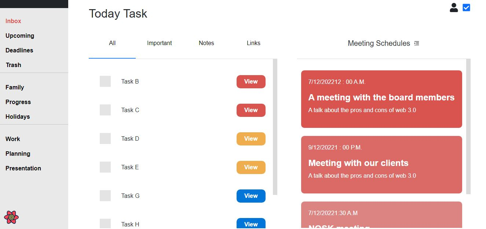

<h1> (Development Phase) React-Task-Tracker </h1>  
<h5> A task tracker (to-do) list application using React JS and React Query</h5>  
 

 React-Task-Tracker is an application that will be intended for office use, where
the admin can assign the tasks and the meetings to the respective employees. 

 

**FEATURES ADDED SO FAR** 
1. Task fetching from the API
2. Individual task viewing
3. Query state display (Loading or Error)   
 

**TO BE ADDED**
1. Login system
2. Admin panel
3. Meeting components
 

**TO DO FOR NOW**
1. Fix the string length of classes 
2. Fix the pop up box for ascending and descending arrangement of meetings
3. Set up a universal CSS file
4. Find a way to assign important meetings using the calculation of assigned date and time in the database
 
**Initial test**
Putting up 2 filters for task and meetings, that will later be be done by the backend
 

**Current Visual**  

 
**NOTE**:- The filtering of task is currently done in the front end which will be later transferred to
the backend. 